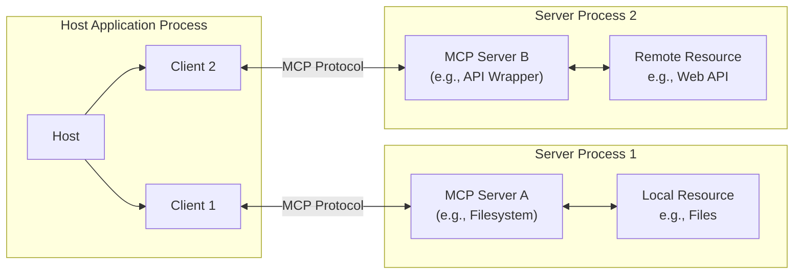

# Developer Note: My Custom Guide for High-Level TypeScript MCP Server Development

This file is my personal, condensed guide focusing on building MCP servers using the **high-level TypeScript SDK (`McpServer`)**. It's tailored for my workflow, emphasizing the recommended abstractions for faster development.

This file is for LLM consumption whereas my other guides (like `mcp-server-development-guide.md`) are for human developers.

Feed this file to your LLM when developing MCP servers with TypeScript. It contains the essential concepts and high-level examples. Low-level SDK details are omitted for brevity and to not confuse the coding agent, but can be found in the official documentation (or my mcp-server-development-guide.md) if needed.

Instructions for using this file: Use this file as a reference for understanding the Model Context Protocol (MCP) and its high-level implementation in TypeScript. It includes key concepts, protocol standards, and best practices for building MCP servers using the `McpServer` class.

---

# Creating a Model Context Protocol (MCP) Server with TypeScript (High-Level SDK)

[](https://modelcontextprotocol.io/)
[](https://github.com/modelcontextprotocol/typescript-sdk)
[](https://github.com/modelcontextprotocol/python-sdk)
[](https://github.com/modelcontextprotocol/kotlin-sdk)
[](https://github.com/modelcontextprotocol/java-sdk)
[](https://github.com/modelcontextprotocol/csharp-sdk)
[](https://github.com/modelcontextprotocol/modelcontextprotocol/blob/main/docs/specification/2025-03-26/changelog.mdx)
[]()

## 1. Introduction

The Model Context Protocol (MCP) provides a standardized communication layer enabling Large Language Models (LLMs) within host applications (clients) to interact securely and effectively with external data sources and tools via dedicated servers. Building an MCP server allows you to expose specific capabilities—such as accessing file systems, querying databases, interacting with APIs, or executing custom logic—to any MCP-compatible client application.

This document focuses on using the **high-level TypeScript SDK (`McpServer`)** to build robust, secure, and interoperable MCP servers efficiently, incorporating the latest [MCP Authentication Specification](https://github.com/modelcontextprotocol/modelcontextprotocol/blob/main/docs/specification/2025-03-26/basic/authorization.mdx) standards for secure interactions.

## 2. Core Concepts & Architecture

MCP employs a client-server architecture:

- **Host:** An application (e.g., Claude Desktop, VS Code) that manages MCP clients and integrates with LLMs. The host enforces security, handles user consent, and orchestrates interactions.
- **Client:** Resides within the host, maintaining a 1:1 stateful connection with a specific MCP server. It handles protocol negotiation and message routing.
- **Server:** A standalone process (local or remote) that exposes specific capabilities (Resources, Tools, Prompts) to a connected client via the MCP protocol. Servers focus on their specific domain and do not directly interact with the LLM or other servers.



**Key Design Principles:** Simplicity, Composability, Isolation, Progressive Features.

## 3. Protocol Basics

MCP uses **JSON-RPC 2.0**. The SDK handles most protocol details.

### 3.1. Connection Lifecycle

1.  **Initialization:** Client and server exchange `initialize` messages, agreeing on `protocolVersion` and `capabilities`. The server provides `serverInfo` and optional `instructions`.
2.  **Operation:** Exchange requests, responses, notifications based on capabilities.
3.  **Shutdown:** Transport layer disconnects.

**Example: Server Initialization (High-Level TypeScript SDK)**

```typescript
import { McpServer } from "@modelcontextprotocol/sdk/server/mcp.js";
import { StdioServerTransport } from "@modelcontextprotocol/sdk/server/stdio.js";
import { logger } from "../utils/logger.js"; // Assuming a logger utility
import { config } from "../config/index.js"; // Assuming a config module

// Server Info and Capabilities are defined during McpServer instantiation
const server = new McpServer(
  {
    // Server Information (Loaded from config)
    name: config.mcpServerName,
    version: config.mcpServerVersion,
  },
  {
    // Server Capabilities Declaration
    // While the SDK can infer capabilities, explicitly declaring them improves clarity.
    capabilities: {
      logging: {}, // Example: Enable logging capability
      resources: { listChanged: true }, // Example: Support dynamic resource lists
      tools: { listChanged: true }, // Example: Support dynamic tool lists
      // prompts: { listChanged: true }, // Example: Support dynamic prompt lists
    },

    // Optional instructions for the client/LLM
    instructions: `This server (${config.mcpServerName} v${config.mcpServerVersion}) uses the high-level SDK.`,
  }
);

logger.info("High-level MCP Server instance created.");

// Connection logic depends on the chosen transport (see Section 7)
// Example for Stdio:
// const transport = new StdioServerTransport();
// await server.connect(transport);
// logger.info("Server connected via Stdio.");
```

### 3.2. Capability Negotiation

Capabilities (`resources`, `tools`, `prompts`, etc.) are declared during initialization. As shown in the example above, while the high-level `McpServer` often infers capabilities based on registered resources/tools/prompts, explicitly declaring them in the constructor options (`capabilities: { ... }`) improves clarity and ensures specific protocol features are advertised correctly.

## 4. Server Capabilities (High-Level SDK)

The `McpServer` class provides convenient methods (`.resource()`, `.tool()`, `.prompt()`) to define capabilities.

### 4.1. Resources

Expose data for LLM context (like GET endpoints).

**Example: Registering Resources (High-Level TypeScript SDK)**

```typescript
import {
  McpServer,
  ResourceTemplate,
} from "@modelcontextprotocol/sdk/server/mcp.js";
import { logger } from "../utils/logger.js"; // Assuming a logger utility

// Assume 'server' is an initialized McpServer instance

// Static resource
server.resource(
  "config", // Unique name for this resource registration
  "config://app", // The URI clients will use
  async (uri) => {
    // Handler function
    logger.debug(`Reading resource: ${uri.href}`);
    return {
      contents: [
        {
          uri: uri.href, // Echo back the requested URI
          mimeType: "text/plain", // Specify the content type
          text: "App configuration data here", // The actual content
        },
      ],
    };
  }
);
logger.info(`Registered static resource: config://app`);

// Dynamic resource with parameters from URI template
server.resource(
  "user-profile", // Unique name for this registration
  new ResourceTemplate("users://{userId}/profile", { list: undefined }), // Template definition
  async (uri, { userId }) => {
    // Handler receives parsed parameters
    logger.debug(`Reading resource: ${uri.href} for userId: ${userId}`);
    // In a real app, fetch user data based on userId
    return {
      contents: [
        {
          uri: uri.href,
          mimeType: "application/json", // Example: returning JSON
          text: JSON.stringify({
            userId: userId,
            name: "Example User",
            email: "user@example.com",
          }),
        },
      ],
    };
  }
);
logger.info(`Registered dynamic resource template: users://{userId}/profile`);

// Optional: Handle list requests if needed (e.g., for file:// resources)
// server.resourceList('file-list', 'file:///', async (request) => { /* ... */ });

// Optional: Handle subscriptions if needed
// server.resourceSubscribe('file-watch', 'file:///{path}', async (request) => { /* ... */ });
// server.resourceUnsubscribe('file-watch', 'file:///{path}', async (request) => { /* ... */ });
// To send updates: server.sendResourceUpdated('file:///path/to/changed.txt');
// To send list changes: server.sendResourceListChanged();
```

### 4.2. Tools

Expose executable functions for the LLM (like POST endpoints). Use Zod for schema definition and validation.

- **Definition:** Defined using `server.tool()`. Provide a `name`, `description`, input schema (using Zod shape), optional `annotations`, and an async handler function.
- **Annotations (Optional):** Provide hints about tool behavior using a standard set of keys defined by the MCP specification. The standard annotations are:
  - `title`: (string) A human-readable title for the tool, potentially used in UI.
  - `readOnlyHint`: (boolean) Suggests the tool does not modify state (like a GET request).
  - `destructiveHint`: (boolean) Suggests the tool might make significant, potentially irreversible changes or deletions.
  - `idempotentHint`: (boolean) Suggests calling the tool multiple times with the same arguments will have the same effect as calling it once.
  - `openWorldHint`: (boolean) Suggests the tool interacts with external systems or data that can change unpredictably between calls (e.g., fetching real-time stock prices, interacting with a volatile API).
- **Trust Model (CRITICAL):** Clients **MUST** treat these annotations purely as **untrusted hints** unless the server providing them is explicitly trusted by the host application or user. Servers **SHOULD NOT** rely on clients strictly adhering to these hints for enforcing security or correctness. The hints are primarily for informing the client/LLM's _strategy_ or the user interface presentation.
- **Custom Annotations:** While the protocol allows adding custom key-value pairs to the annotations object beyond the standard ones, clients are not guaranteed to understand or utilize them. The same trust model applies: custom annotations are untrusted hints. Stick to standard annotations for broadest compatibility.
- **Invocation:** The LLM decides when to call tools; the client mediates and sends a `tools/call` request. The SDK handles routing to your handler.
- **Response:** Your handler should return a `CallToolResult` object (`{ content: [...], isError?: boolean }`). Execution errors are reported via `isError: true` and details in `content`.
- **Schema Importance:** Detailed Zod schemas significantly improve the LLM's ability to use the tool correctly.

**Example: Registering Tools (High-Level TypeScript SDK)**

```typescript
import { McpServer } from "@modelcontextprotocol/sdk/server/mcp.js";
import { z } from "zod"; // For schema definition
import { logger } from "../utils/logger.js"; // Assuming a logger utility
import { TextContent } from "@modelcontextprotocol/sdk/types.js"; // Specific content type

// Assume 'server' is an initialized McpServer instance

// Simple tool with parameters defined using Zod
server.tool(
  "calculate-bmi", // Tool name
  "Calculates Body Mass Index.", // Tool description
  {
    // Input schema shape (Zod object shape)
    weightKg: z.number().describe("Weight in kilograms"),
    heightM: z.number().positive().describe("Height in meters"),
  },
  // Optional: Tool Annotations
  { title: "BMI Calculator", readOnlyHint: true },
  // Handler function receives validated arguments
  async ({ weightKg, heightM }) => {
    logger.debug(`Executing tool: calculate-bmi`, { weightKg, heightM });
    const bmi = weightKg / (heightM * heightM);
    const resultContent: TextContent = {
      type: "text",
      text: `BMI: ${bmi.toFixed(2)}`,
    };
    return {
      content: [resultContent], // Array of content parts
      // isError: false // Default is false
    };
    // On execution error, return:
    // return { content: [{ type: 'text', text: 'Error: Invalid height' }], isError: true };
  }
);
logger.info(`Registered tool: calculate-bmi`);

// Async tool example (e.g., fetching external data)
server.tool(
  "fetch-weather",
  "Fetches weather for a given city.",
  { city: z.string().min(1).describe("The city name") },
  // Annotations: Title, read-only (doesn't change local state), open world (external API)
  { title: "Fetch Weather", readOnlyHint: true, openWorldHint: true },
  async ({ city }) => {
    logger.debug(`Executing tool: fetch-weather`, { city });
    try {
      // Replace with actual API call
      const response = await fetch(
        `https://api.example-weather.com/?city=${encodeURIComponent(city)}`
      );
      if (!response.ok) {
        throw new Error(`API request failed with status ${response.status}`);
      }
      const data = await response.text(); // Or response.json()
      const resultContent: TextContent = { type: "text", text: data };
      return { content: [resultContent] };
    } catch (error) {
      logger.error("fetch-weather tool failed", { error });
      const errorMessage =
        error instanceof Error ? error.message : "Unknown error";
      const errorContent: TextContent = {
        type: "text",
        text: `Error fetching weather: ${errorMessage}`,
      };
      return { content: [errorContent], isError: true };
    }
  }
);
logger.info(`Registered tool: fetch-weather`);

// Optional: To notify clients of dynamic tool changes:
// server.sendToolListChanged();
```

### 4.3. Prompts

Provide reusable prompt templates, often surfaced as UI elements (e.g., slash commands).

**Example: Registering Prompts (High-Level TypeScript SDK)**

```typescript
import { McpServer } from "@modelcontextprotocol/sdk/server/mcp.js";
import { z } from "zod"; // For argument schema
import { logger } from "../utils/logger.js"; // Assuming a logger utility
import { Role } from "@modelcontextprotocol/sdk/types.js"; // Role enum

// Assume 'server' is an initialized McpServer instance

server.prompt(
  "review-code", // Prompt name (often used for slash commands)
  "Generates a prompt to ask the LLM to review code.", // Description
  {
    // Argument schema shape (Zod object shape)
    code: z.string().min(10).describe("The code snippet to review"),
  },
  // Handler function receives validated arguments
  ({ code }) => {
    logger.debug(`Generating prompt: review-code`);
    // Construct the messages for the LLM
    return {
      // Optional description for the specific invocation
      // description: `Requesting review for code snippet starting with: "${code.substring(0, 30)}..."`,
      messages: [
        // Array of messages forming the prompt
        {
          role: Role.USER, // Or Role.ASSISTANT
          content: [
            // Content is always an array
            {
              type: "text", // Content type
              text: `Please review the following code for potential issues and suggest improvements:\n\n\`\`\`\n${code}\n\`\`\``,
            },
            // Can include other content types like images if needed
          ],
        },
      ],
    };
  }
);
logger.info(`Registered prompt: review-code`);

// Optional: To notify clients of dynamic prompt changes:
// server.sendPromptListChanged();
```

### 4.4. Modular Capability Structure (Recommended Practice)

For better organization and maintainability, especially in larger servers, consider separating the logic of your resources and tools from their registration code. This pattern promotes separation of concerns.

**Example: Modular Tool Structure**

```typescript
// --- src/mcp-server/tools/myTool/myToolLogic.ts ---
// Contains the core logic and schema for the tool.
import { z } from "zod";
import { TextContent } from "@modelcontextprotocol/sdk/types.js";
import { logger } from "../../../utils/logger.js"; // Adjust path as needed

// Define input schema using Zod
export const myToolInputSchema = z.object({
  parameter1: z.string().describe("Description for parameter 1"),
  parameter2: z.number().optional().describe("Optional number parameter"),
});

// Define the handler function
export async function handleMyTool(
  args: z.infer<typeof myToolInputSchema>
): Promise<{ content: TextContent[]; isError?: boolean }> {
  logger.debug("Executing myTool logic", args);
  // --- Tool implementation goes here ---
  const resultText = `Processed ${args.parameter1} with optional ${
    args.parameter2 ?? "N/A"
  }`;
  return {
    content: [{ type: "text", text: resultText }],
  };
}

// --- src/mcp-server/tools/myTool/registration.ts ---
// Handles registering the tool with the McpServer instance.
import { McpServer } from "@modelcontextprotocol/sdk/server/mcp.js";
import { myToolInputSchema, handleMyTool } from "./myToolLogic.js";
import { logger } from "../../../utils/logger.js"; // Adjust path as needed

export function registerMyTool(server: McpServer): void {
  server.tool(
    "my-tool", // Tool name
    "A description of what my-tool does.", // Description
    myToolInputSchema, // Pass the imported schema shape
    // Optional annotations
    { title: "My Awesome Tool", readOnlyHint: true },
    handleMyTool // Pass the imported handler function
  );
  logger.info("Registered tool: my-tool");
}

// --- src/mcp-server/server.ts ---
// The main server orchestration file imports and calls registration functions.
import { McpServer } from "@modelcontextprotocol/sdk/server/mcp.js";
import { registerMyTool } from "./tools/myTool/registration.js"; // Import registration
import { config } from "../../config/index.js"; // Adjust path as needed
import { logger } from "../../utils/logger.js"; // Adjust path as needed
// ... other imports like transports ...

function createMcpServerInstance(): McpServer {
  const server = new McpServer(
    { name: config.mcpServerName, version: config.mcpServerVersion },
    {
      /* capabilities */
    }
  );

  // Register capabilities by calling their registration functions
  registerMyTool(server);
  // registerOtherTool(server);
  // registerMyResource(server);

  logger.info("MCP Server instance configured with capabilities.");
  return server;
}

// ... rest of server startup logic (transports, etc.) ...
```

This structure makes it easier to manage individual capabilities, test their logic independently, and keep the main `server.ts` file focused on orchestration.

## 5. Dynamic Server Capabilities

You can add, remove, enable, disable, or update tools, resources, and prompts _after_ the server is connected. The `McpServer` automatically sends the necessary `listChanged` notifications.

```typescript
import { McpServer } from "@modelcontextprotocol/sdk/server/mcp.js";
import { z } from "zod";
import { StdioServerTransport } from "@modelcontextprotocol/sdk/server/stdio.js";
import { logger } from "../utils/logger.js"; // Assuming a logger utility

// Assume listMessages, putMessage, upgradeAuthAndStoreToken functions exist

const server = new McpServer({
  name: "Dynamic Example",
  version: "1.0.0",
});

// Register initial tools
const listMessageTool = server.tool(
  "listMessages",
  "Lists messages in a channel.",
  { channel: z.string().describe("Channel name") },
  // Annotations: Title, read-only
  { title: "List Channel Messages", readOnlyHint: true },
  async ({ channel }) => ({
    content: [{ type: "text", text: await listMessages(channel) }],
  })
);

const putMessageTool = server.tool(
  "putMessage",
  "Sends a message to a channel.",
  {
    channel: z.string().describe("Channel name"),
    message: z.string().min(1).describe("Message content"),
  },
  // Annotations: Title (not read-only, potentially idempotent depending on backend)
  { title: "Send Channel Message" /* idempotentHint: true (optional) */ },
  async ({ channel, message }) => ({
    content: [{ type: "text", text: await putMessage(channel, message) }],
  })
);

// Start with the 'putMessage' tool disabled
putMessageTool.disable();
logger.info(`Tool 'putMessage' initially disabled.`);

const upgradeAuthTool = server.tool(
  "upgradeAuth",
  "Upgrades authorization level.",
  {
    permission: z
      .enum(["write", "admin"])
      .describe("Permission level to upgrade to"),
  },
  // Annotations: Title (modifies state, not read-only)
  {
    title:
      "Upgrade Authorization" /* destructiveHint: false (usually not destructive) */,
  },
  // Handler receives validated arguments
  async ({ permission }) => {
    logger.info(`Attempting to upgrade auth to: ${permission}`);
    // Assume this function handles the auth logic and returns status
    const { ok, err, previousPermission } = await upgradeAuthAndStoreToken(
      permission
    );

    if (!ok) {
      logger.error(`Auth upgrade failed: ${err}`);
      return {
        content: [{ type: "text", text: `Error: ${err}` }],
        isError: true,
      };
    }

    logger.info(
      `Auth upgraded successfully from ${previousPermission} to ${permission}.`
    );

    // If we previously had read-only access (or similar), enable 'putMessage'
    if (previousPermission !== "write" && previousPermission !== "admin") {
      logger.info(`Enabling 'putMessage' tool.`);
      putMessageTool.enable(); // Automatically sends listChanged
    }

    if (permission === "write") {
      // If upgraded to 'write', update 'upgradeAuth' to only allow 'admin' next
      logger.info(`Updating 'upgradeAuth' tool to only allow 'admin' upgrade.`);
      upgradeAuthTool.update({
        // Only update the schema part
        paramSchema: {
          permission: z.enum(["admin"]).describe("Upgrade to admin permission"),
        },
      }); // Automatically sends listChanged
    } else if (permission === "admin") {
      // If upgraded to 'admin', remove the upgrade tool entirely
      logger.info(`Removing 'upgradeAuth' tool as user is now admin.`);
      upgradeAuthTool.remove(); // Automatically sends listChanged
    }

    return {
      content: [
        { type: "text", text: `Successfully upgraded auth to ${permission}` },
      ],
    };
  }
);

// Connect the server (example using Stdio)
async function startServer() {
  logger.info("Starting dynamic server example...");
  const transport = new StdioServerTransport();
  transport.onclose = () => {
    logger.info("Transport closed.");
    process.exit(0);
  };
  await server.connect(transport);
  logger.info("Server connected via Stdio.");
}

startServer();

// --- Dummy implementations for demonstration ---
async function listMessages(channel: string): Promise<string> {
  return `Messages in ${channel}`;
}
async function putMessage(channel: string, message: string): Promise<string> {
  return `Message "${message}" sent to ${channel}`;
}
async function upgradeAuthAndStoreToken(
  permission: "write" | "admin"
): Promise<{ ok: boolean; err?: string; previousPermission: string }> {
  // Simulate auth upgrade logic
  // In a real app, interact with auth system and store token
  const currentPermission = permission === "write" ? "read" : "write"; // Simulate previous state
  return { ok: true, previousPermission: currentPermission };
}
```

## 6. Running Your Server

Connect your `McpServer` instance to a transport.

### 6.1. Stdio Transport

Ideal for local command-line servers.

```typescript
import { McpServer } from "@modelcontextprotocol/sdk/server/mcp.js";
import { StdioServerTransport } from "@modelcontextprotocol/sdk/server/stdio.js";
import { logger } from "../utils/logger.js"; // Assuming a logger utility

async function startStdioServer() {
  const server = new McpServer({ name: "stdio-server", version: "1.0.0" });
  // ... register resources, tools, prompts using server.resource(), server.tool(), server.prompt() ...
  logger.info("Stdio Server configured.");

  const transport = new StdioServerTransport();
  transport.onclose = () => {
    logger.info("Stdio transport closed. Exiting.");
    process.exit(0);
  };

  await server.connect(transport);
  logger.info("Server connected via Stdio.");
}

startStdioServer();
```

### 6.2. Streamable HTTP Transport

For remote servers or web-based clients. Handles client requests (POST) and server notifications (via SSE on GET). **Crucially, non-stdio transports like HTTP now mandate secure authentication as per the MCP Authentication Specification.** Communication **MUST** use HTTPS.

**With Session Management (Stateful):** Recommended for most HTTP servers to handle multiple clients correctly.

```typescript
import express from "express";
import { randomUUID } from "node:crypto";
import { McpServer } from "@modelcontextprotocol/sdk/server/mcp.js";
import { StreamableHTTPServerTransport } from "@modelcontextprotocol/sdk/server/streamableHttp.js";
import { isInitializeRequest } from "@modelcontextprotocol/sdk/types.js";
import { logger } from "../utils/logger.js"; // Assuming a logger utility
import { config } from "../config/index.js"; // Assuming a config module

const HTTP_PORT = config.mcpHttpPort; // Load from config
const HTTP_HOST = config.mcpHttpHost; // Load from config (e.g., '127.0.0.1' or '0.0.0.0')
const MCP_ENDPOINT_PATH = "/mcp";

// Map to store transports by session ID
const transports: { [sessionId: string]: StreamableHTTPServerTransport } = {};

// Function to create and configure a server instance (could be reused)
function createServerInstance(): McpServer {
  const server = new McpServer({
    name: "http-session-server",
    version: "1.0.0",
  });
  // ... register resources, tools, prompts ...
  logger.info("Created new McpServer instance for session.");
  return server;
}

// Note: Production servers often require more robust startup logic,
// including retrying the port if the default is already in use.
// Consider implementing port retry mechanisms for resilience.

async function startHttpServer() {
  const app = express();
  app.use(express.json());
  // --- CRITICAL SECURITY MIDDLEWARE ---
  // 1. CORS/Origin Check (See Section 8 Example)
  // app.use(originCheckMiddleware);
  // 2. MCP Authentication Middleware (Implement based on MCP Auth Spec - OAuth 2.0)
  //    This middleware should verify tokens, enforce scopes, etc.
  // app.use(mcpAuthMiddleware);
  // ------------------------------------

  // Handle POST requests (client-to-server)
  app.post(MCP_ENDPOINT_PATH, async (req, res) => {
    const sessionId = req.headers["mcp-session-id"] as string | undefined;
    let transport: StreamableHTTPServerTransport | undefined = sessionId
      ? transports[sessionId]
      : undefined;

    try {
      if (transport) {
        logger.debug(`Reusing transport for session: ${sessionId}`);
      } else if (!sessionId && isInitializeRequest(req.body)) {
        // New connection: Create transport and server instance
        logger.info("New initialize request, creating session...");
        transport = new StreamableHTTPServerTransport({
          sessionIdGenerator: () => randomUUID(),
          onsessioninitialized: (newSessionId) => {
            if (transport) {
              // Store transport once session ID is confirmed
              transports[newSessionId] = transport;
              logger.info(`Session initialized and stored: ${newSessionId}`);
            }
          },
        });

        transport.onclose = () => {
          if (transport?.sessionId && transports[transport.sessionId]) {
            logger.info(
              `Session closed, removing transport: ${transport.sessionId}`
            );
            delete transports[transport.sessionId];
                    // Optionally clean up server instance if stateful per session
            // Consider calling server.close() here if the server instance
            // holds resources tied to the session that need explicit release.
          }
        };

        const server = createServerInstance(); // Create a server for this session
        // Handle graceful shutdown: Ensure server.close() is called when the
        // application terminates to release resources. This might involve
        // listening for process signals like SIGINT or SIGTERM.
        // process.on('SIGINT', async () => { await server.close(); process.exit(0); });
        await server.connect(transport); // Connect server to the new transport
      } else {
        logger.warn(
          "Bad POST request: Invalid session or non-init request without session ID."
        );
        res.status(400).json({
          jsonrpc: "2.0",
          error: {
            code: -32000,
            message: "Bad Request: Session ID required or invalid",
          },
          id: null,
        });
        return;
      }

      // Let the transport handle the request logic
      await transport.handleRequest(req, res, req.body);
    } catch (error) {
      logger.error(`Error handling POST for session ${sessionId}`, { error });
      if (!res.headersSent) {
        res.status(500).send("Internal Server Error");
      }
    }
  });

  // Reusable handler for GET (SSE stream) and DELETE (session termination)
  const handleSessionRequest = async (
    req: express.Request,
    res: express.Response
  ) => {
    const sessionId = req.headers["mcp-session-id"] as string | undefined;
    const transport = sessionId ? transports[sessionId] : undefined;

    if (!transport) {
      logger.warn(
        `No transport found for session ID: ${sessionId} on ${req.method}`
      );
      res.status(400).send("Invalid or missing session ID");
      return;
    }

    try {
      // Let the transport handle GET (SSE setup) or DELETE (session close)
      await transport.handleRequest(req, res);
      logger.debug(`${req.method} handled for session: ${sessionId}`);
    } catch (error) {
      logger.error(`Error handling ${req.method} for session ${sessionId}`, {
        error,
      });
      if (!res.headersSent && req.method !== "DELETE") {
        // Avoid sending error on DELETE if already handled
        res.status(500).send("Internal Server Error");
      } else if (!res.headersSent && req.method === "DELETE") {
        res.status(204).send(); // Assume close was successful even if error occurred during handling
      }
    }
  };

  app.get(MCP_ENDPOINT_PATH, handleSessionRequest);
  app.delete(MCP_ENDPOINT_PATH, handleSessionRequest);

  // Use HTTP_HOST from config for binding
  app.listen(HTTP_PORT, HTTP_HOST, () => {
    logger.info(
      `HTTP server with session management listening on ${HTTP_HOST}:${HTTP_PORT}`
    );
  });
}

startHttpServer();
```

**Without Session Management (Stateless):** Simpler, but less common. Creates a new server/transport per request. Suitable only for truly stateless operations.

```typescript
import express, { Request, Response } from "express";
import { McpServer } from "@modelcontextprotocol/sdk/server/mcp.js";
import { StreamableHTTPServerTransport } from "@modelcontextprotocol/sdk/server/streamableHttp.js";
import { logger } from "../utils/logger.js"; // Assuming a logger utility
import { config } from "../config/index.js"; // Assuming a config module

const HTTP_PORT = config.mcpHttpPort; // Load from config
const HTTP_HOST = config.mcpHttpHost; // Load from config
const MCP_ENDPOINT_PATH = "/mcp";

// Function to create and configure a server instance (must be stateless)
function createStatelessServerInstance(): McpServer {
  const server = new McpServer({
    name: "http-stateless-server",
    version: "1.0.0",
  });
  // ... register ONLY stateless resources, tools, prompts ...
  logger.info("Created new STATELESS McpServer instance.");
  return server;
}

async function startStatelessHttpServer() {
  const app = express();
  app.use(express.json());
  // IMPORTANT: Add security middleware (CORS, Origin check, Auth) here!

  app.post(MCP_ENDPOINT_PATH, async (req: Request, res: Response) => {
    // Create a new server and transport for each request to ensure isolation
    let server: McpServer | null = null;
    let transport: StreamableHTTPServerTransport | null = null;
    try {
      server = createStatelessServerInstance();
      transport = new StreamableHTTPServerTransport({
        sessionIdGenerator: undefined,
      }); // No sessions

      // Ensure cleanup happens when the client disconnects
      res.on("close", () => {
        logger.debug("Stateless request connection closed, cleaning up.");
        transport?.close(); // Close transport
        server?.close(); // Close server instance
      });

      await server.connect(transport);
      await transport.handleRequest(req, res, req.body);
    } catch (error) {
      logger.error("Error handling stateless MCP POST request:", { error });
      // Ensure cleanup even on error
      transport?.close();
      server?.close();
      if (!res.headersSent) {
        res.status(500).json({
          jsonrpc: "2.0",
          error: { code: -32603, message: "Internal server error" },
          id: null,
        });
      }
    }
  });

  // GET and DELETE are not typically supported in stateless mode without sessions
  const methodNotAllowedHandler = (req: Request, res: Response) => {
    logger.warn(`Method ${req.method} not allowed on stateless endpoint.`);
    res.status(405).json({
      jsonrpc: "2.0",
      error: { code: -32000, message: "Method Not Allowed" },
      id: null,
    });
  };
  app.get(MCP_ENDPOINT_PATH, methodNotAllowedHandler);
  app.delete(MCP_ENDPOINT_PATH, methodNotAllowedHandler);

  // Use HTTP_HOST from config for binding
  app.listen(HTTP_PORT, HTTP_HOST, () => {
    logger.info(
      `Stateless Streamable HTTP Server listening on ${HTTP_HOST}:${HTTP_PORT}`
    );
  });
}

startStatelessHttpServer();
```

## 7. Examples

### 7.1. Echo Server

Demonstrates basic resources, tools, and prompts using the high-level SDK.

```typescript
import {
  McpServer,
  ResourceTemplate,
} from "@modelcontextprotocol/sdk/server/mcp.js";
import { StdioServerTransport } from "@modelcontextprotocol/sdk/server/stdio.js";
import { z } from "zod";
import { Role } from "@modelcontextprotocol/sdk/types.js";
import { logger } from "../utils/logger.js"; // Assuming a logger utility

async function startEchoServer() {
  const server = new McpServer({ name: "EchoServer", version: "1.0.0" });

  // Echo Resource
  server.resource(
    "echo-resource", // Registration name
    new ResourceTemplate("echo://{message}", { list: undefined }), // URI Template
    async (uri, { message }) => {
      // Handler
      logger.debug(`Echo resource called: ${uri.href}`);
      return {
        contents: [
          {
            uri: uri.href,
            mimeType: "text/plain",
            text: `Resource echo: ${message}`,
          },
        ],
      };
    }
  );

  // Echo Tool
  server.tool(
    "echo-tool", // Tool name
    "Echoes back the provided message via a tool.", // Description
    { message: z.string().min(1).describe("Message to echo") }, // Input schema
    // Annotations: Title, read-only
    { title: "Echo Message (Tool)", readOnlyHint: true },
    async ({ message }) => {
      // Handler
      logger.debug(`Echo tool called with message: ${message}`);
      return { content: [{ type: "text", text: `Tool echo: ${message}` }] };
    }
  );

  // Echo Prompt
  server.prompt(
    "echo-prompt", // Prompt name
    "Generates a prompt containing the message.", // Description
    { message: z.string().min(1).describe("Message for the prompt") }, // Argument schema
    ({ message }) => {
      // Handler
      logger.debug(`Echo prompt generated for message: ${message}`);
      return {
        messages: [
          {
            role: Role.USER,
            content: [
              { type: "text", text: `Please process this message: ${message}` },
            ],
          },
        ],
      };
    }
  );

  logger.info("Echo server configured.");
  const transport = new StdioServerTransport();
  transport.onclose = () => {
    logger.info("Echo server transport closed.");
    process.exit(0);
  };
  await server.connect(transport);
  logger.info("Echo server connected via Stdio.");
}

startEchoServer();
```

### 7.2. SQLite Explorer

Demonstrates integrating with a database.

```typescript
import { McpServer } from "@modelcontextprotocol/sdk/server/mcp.js";
import { StdioServerTransport } from "@modelcontextprotocol/sdk/server/stdio.js";
import sqlite3 from "sqlite3";
import { open } from "sqlite"; // Use the promise-based wrapper
import { z } from "zod";
import { logger } from "../utils/logger.js"; // Assuming a logger utility

const DB_FILE = "database.db"; // Ensure this file exists or is created

async function startSQLiteServer() {
  // Initialize DB (Create table if not exists - example)
  const db = await open({ filename: DB_FILE, driver: sqlite3.Database });
  await db.exec(
    "CREATE TABLE IF NOT EXISTS items (id INTEGER PRIMARY KEY, name TEXT)"
  );
  await db.close();
  logger.info(`Database ${DB_FILE} initialized.`);

  const server = new McpServer({ name: "SQLite Explorer", version: "1.0.0" });

  // Resource to get table schema
  server.resource(
    "schema",
    "db://schema", // Simple URI for the schema
    async (uri) => {
      logger.debug(`Reading schema resource: ${uri.href}`);
      const db = await open({ filename: DB_FILE, driver: sqlite3.Database });
      try {
        const tables = await db.all(
          "SELECT sql FROM sqlite_master WHERE type='table'"
        );
        const schemaText = tables
          .map((t: { sql: string }) => t.sql)
          .join("\n\n");
        return {
          contents: [
            {
              uri: uri.href,
              mimeType: "text/sql",
              text: schemaText || "-- No tables found --",
            },
          ],
        };
      } finally {
        await db.close();
      }
    }
  );

  // Tool to execute a query
  server.tool(
    "query",
    "Executes a read-only SQL query.",
    { sql: z.string().min(1).describe("The SQL query to execute") },
    { readOnlyHint: true, title: "Run SQL Query" }, // Annotations
    async ({ sql }) => {
      logger.debug(`Executing query tool: ${sql}`);
      // WARNING: The basic regex check below is INSUFFICIENT for production security
      // if the SQL query could potentially be influenced by untrusted input.
      // It only prevents the most basic modification attempts. For robust protection
      // against SQL injection, use parameterized queries or a dedicated query builder
      // that properly sanitizes inputs, especially if 'sql' originates from or is
      // influenced by external sources. Since this example assumes 'sql' comes
      // directly from the LLM/client (which should ideally be validated upstream),
      // this basic check is illustrative but not exhaustive.
      if (!/^\s*SELECT/i.test(sql)) {
        logger.warn(`Query tool rejected non-SELECT statement: ${sql}`);
        return {
          content: [
            { type: "text", text: "Error: Only SELECT queries are allowed." },
          ],
          isError: true,
        };
      }

      const db = await open({ filename: DB_FILE, driver: sqlite3.Database });
      try {
        const results = await db.all(sql);
        return {
          content: [{ type: "text", text: JSON.stringify(results, null, 2) }],
        };
      } catch (err: unknown) {
        const error = err as Error;
        logger.error(`Query tool error: ${error.message}`, { sql });
        return {
          content: [{ type: "text", text: `Error: ${error.message}` }],
          isError: true,
        };
      } finally {
        await db.close();
      }
    }
  );

  logger.info("SQLite server configured.");
  const transport = new StdioServerTransport();
  transport.onclose = () => {
    logger.info("SQLite server transport closed.");
    process.exit(0);
  };
  await server.connect(transport);
  logger.info("SQLite server connected via Stdio.");
}

startSQLiteServer();
```

## 8. Security Considerations

Security is paramount in MCP. Adhere strictly to these principles, incorporating the latest [MCP Authentication Specification](https://github.com/modelcontextprotocol/specification/blob/main/docs/specification/2025-03-26/basic/authorization.md):

1.  **Input Validation & Sanitization:** Use Zod schemas (`server.tool()`, etc.) for structural validation. Implement **context-aware semantic validation** and **input sanitization** within handlers to prevent injection attacks and ensure data integrity, especially before interacting with databases or external systems.
2.  **Strict Protocol Validation:** Ensure the server rigorously validates incoming MCP messages against the protocol specification (structure, field consistency, recursion depth) to prevent malformed request attacks. The SDK handles much of this, but be mindful in custom logic.
3.  **Mandatory Authentication (Non-Stdio):** For transports like HTTP, **secure authentication is mandatory**. Implement the **MCP Authentication Specification**, which is based on **OAuth 2.0**. This includes:
    - Using secure flows like **Authorization Code with PKCE**.
    - Supporting **dynamic client registration** where applicable.
    - Enforcing scope checks based on user consent.
    - Integrating with trusted **third-party identity providers** (e.g., Auth0, Okta) is a common pattern.
4.  **Secure Credential Handling:** Store any required credentials (e.g., API keys, database passwords) securely using system keychains or dedicated secrets managers. **Never expose secrets in plaintext** configuration or logs.
5.  **HTTPS Enforcement:** All HTTP-based communication **MUST** use HTTPS to ensure confidentiality and integrity. Configure your server accordingly (TLS certificates).
6.  **Access Control & Least Privilege:** Respect client-provided roots. Run server processes with the minimum permissions necessary. Design tools and resources to operate with the least privilege required.
7.  **Rate Limiting:** Implement rate limiting, especially for tools interacting with external APIs or performing resource-intensive operations, to prevent Denial-of-Service (DoS) attacks.
8.  **Configuration & Secrets Management:** Load configuration securely. Common patterns include using environment variables (often loaded via `.env` files during development - ensure `.env` is in `.gitignore`) or dedicated secrets management services for sensitive data like API keys or database credentials. Avoid hardcoding secrets.
9.  **Output Sanitization:** Be cautious about the data returned in responses. Avoid leaking sensitive information, internal system details, or excessive error details.
10. **Dependency Security:** Regularly audit dependencies (`npm audit`, `yarn audit`) and keep them updated to patch known vulnerabilities.
11. **Transport Security (Origin/CORS):** For HTTP transport, strictly validate `Origin` headers using an allowlist (see example below). Configure CORS headers correctly. Bind to `127.0.0.1` (`localhost`) for servers intended only for local access.

**Example: Basic Origin Check Middleware (Express)**

```typescript
import { Request, Response, NextFunction } from "express";
import { logger } from "../utils/logger.js";
import { config } from "../config/index.js"; // Assuming config loads env vars

// Load allowed origins from configuration (which likely reads from environment variables)
const ALLOWED_ORIGINS = new Set(config.mcpAllowedOrigins || []);
// Example: MCP_ALLOWED_ORIGINS="http://localhost:8080,https://my-trusted-client.com"

export function originCheckMiddleware(
  req: Request,
  res: Response,
  next: NextFunction
) {
  const origin = req.headers.origin;
  const host = req.hostname; // Express resolves this based on Host header or socket info

  // Check if the server is effectively bound only to loopback addresses
  // Note: Checking req.socket.localAddress might be more reliable than hostname in some setups.
  const isLocalhostBinding = ["127.0.0.1", "::1", "localhost"].includes(host);

  // Determine if the origin is allowed:
  // 1. Origin header is present AND is in the configured allowlist.
  // 2. Server is bound to localhost AND Origin header is missing OR 'null'
  //    (common for Electron/local file:// - accept ONLY if strictly localhost-bound).
  const isOriginAllowed =
    (origin && ALLOWED_ORIGINS.has(origin)) ||
    (isLocalhostBinding && (!origin || origin === "null"));

  if (isOriginAllowed) {
    logger.debug(
      `Origin allowed: ${origin || "(missing/null)"} for host ${host}`
    );
    if (origin) {
      // Set CORS header ONLY if origin is present and allowed
      res.setHeader("Access-Control-Allow-Origin", origin);
      // IMPORTANT: Add other necessary CORS headers
      res.setHeader(
        "Access-Control-Allow-Methods",
        "GET, POST, DELETE, OPTIONS"
      ); // Adjust as needed
      res.setHeader(
        "Access-Control-Allow-Headers",
        "Content-Type, Mcp-Session-Id, Last-Event-ID, Authorization" // Include Mcp-Session-Id and others
      );
      // res.setHeader('Access-Control-Allow-Credentials', 'true'); // Only if using credentials/cookies

      // Add other useful security headers
      res.setHeader("X-Content-Type-Options", "nosniff"); // Prevent MIME type sniffing
      res.setHeader("Referrer-Policy", "strict-origin-when-cross-origin"); // Control referrer information
      // Consider adding: 'Content-Security-Policy', 'Strict-Transport-Security' (HSTS)
    }
    // Handle OPTIONS preflight requests
    if (req.method === "OPTIONS") {
      res.sendStatus(204); // No Content
      return;
    }
    next();
  } else {
    logger.warn(`Forbidden: Origin not allowed: ${origin}`, {
      host,
      allowed: [...ALLOWED_ORIGINS],
    });
    res.status(403).send("Forbidden: Invalid Origin");
  }
}

// Usage in Express app:
// import express from 'express';
// const app = express();
// app.use(originCheckMiddleware); // Apply early
// app.use(express.json()); // Then parse JSON
// ... rest of your MCP routes ...
```

**Note on Utility Modules:** Features like rate limiting, input sanitization beyond basic Zod validation, and complex authentication logic are often best implemented in dedicated utility modules (e.g., `src/utils/security/rateLimiter.ts`, `src/utils/auth/tokenValidator.ts`) and integrated as middleware or called directly where needed.

## 9. Debugging and Testing

- **Logging:** Use a robust logging library like Winston. Log structured JSON to `stderr` for stdio transport, or use `server.sendNotification("notifications/message", ...)` if the client supports logging capabilities. Consider using Request Context services (like `AsyncLocalStorage` in Node.js) to associate logs with specific requests or sessions for easier tracing in complex applications (see Section 10).
- **Error Handling:** Implement a centralized error handling strategy. Consider a dedicated `ErrorHandler` utility or middleware that catches unhandled exceptions, logs detailed context (including request context if available), and ensures graceful shutdown or appropriate error responses. Avoid leaking sensitive stack traces in production error messages.
- **MCP Inspector:** Use `npx @modelcontextprotocol/inspector` to interactively test your server's capabilities and responses.

## 10. Advanced Topics (Brief Mention)

- **Low-Level SDK:** For fine-grained control over the protocol, use the base `Server` class instead of `McpServer`. This requires manual handling of requests and responses using schemas. See official docs for details.
- **Client SDK:** The `@modelcontextprotocol/sdk` also includes classes (`Client`, `StdioClientTransport`, `StreamableHTTPClientTransport`) for building MCP clients.
- **Authentication:** Implementing the official [MCP Authentication Specification](https://github.com/modelcontextprotocol/specification/blob/main/docs/specification/2025-03-26/basic/authorization.md) is **critical** for secure non-stdio transports. This involves understanding OAuth 2.0 flows (PKCE), scope management, and potentially integrating with identity providers. Refer to the spec for detailed requirements.
- **Request Context / Tracing:** For complex servers, especially those handling multiple concurrent requests (like HTTP), use techniques like Node.js `AsyncLocalStorage` to create a context per request. This allows you to associate logs, metrics, and tracing information with a specific operation throughout its lifecycle, greatly aiding debugging.
- **Backwards Compatibility:** The SDK provides ways to maintain compatibility with older transport versions if needed (see README/docs).

## 11. Conclusion

The high-level TypeScript `McpServer` SDK provides a powerful and efficient way to build MCP servers. By defining resources, tools, and prompts using its convenient methods and adhering to security best practices, you can create robust integrations for LLM applications. Remember to consult the official [MCP documentation](https://modelcontextprotocol.io) and [specification](https://spec.modelcontextprotocol.io) for further details.